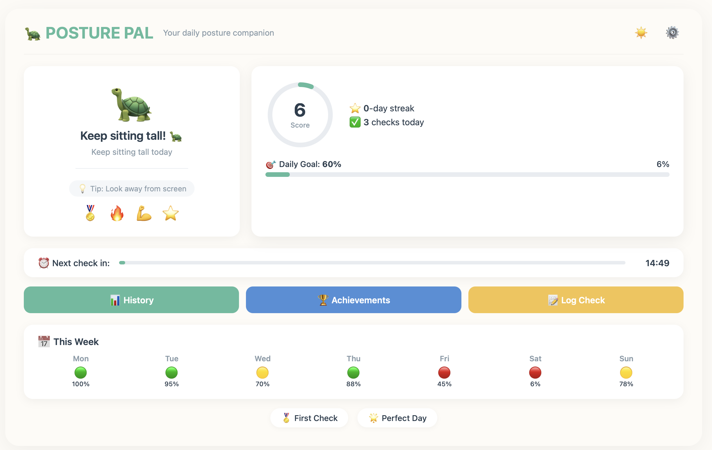
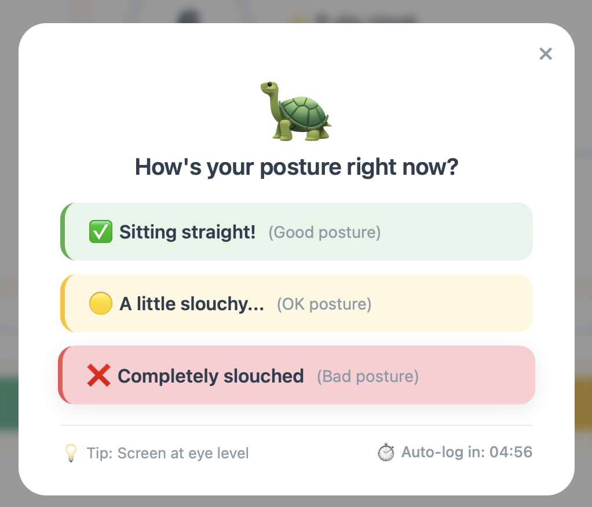
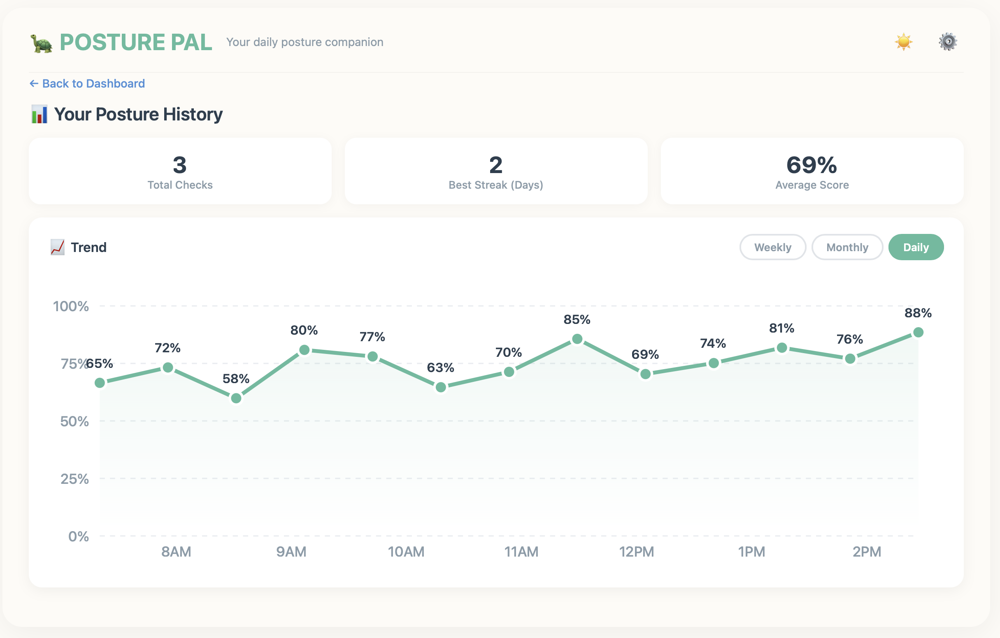
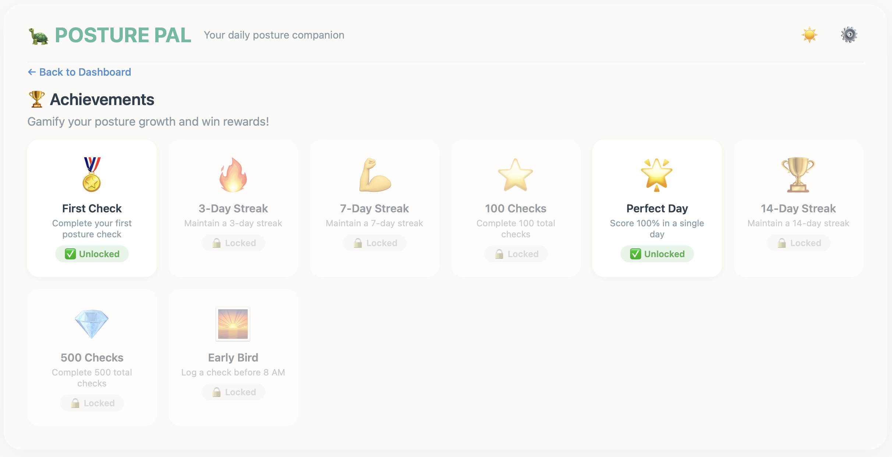
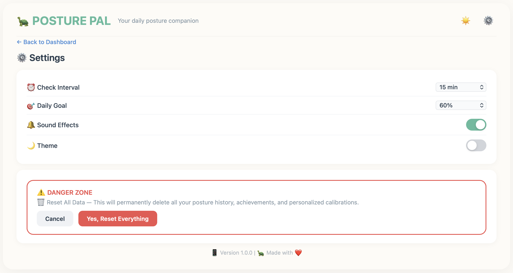
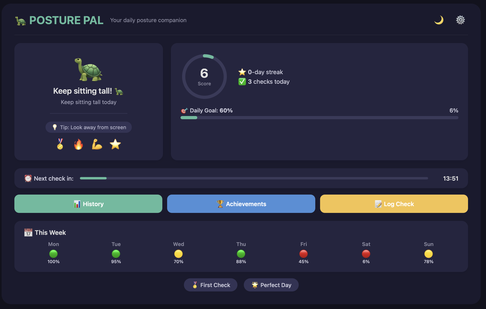

# 🐢 Posture Pal

A posture tracking app for students who spend long hours on screens.  
*Built for PeddieHacks 2026 – Health Track (High School Division)*

---

## The Problem

Students like me spend 6+ hours on screens daily. Poor sitting posture leads to:
- Back pain and neck strain
- Headaches and fatigue
- Long-term health issues

I personally struggle with slouching while studying – so I built Posture Pal to help myself and others build better habits.

---

## The Solution

Posture Pal is a student-friendly posture tracker that:

- ⏰ **Reminds you** every 15/20/30 minutes (you choose the interval!)
- 📊 **Tracks your streak** and daily posture score
- 🏆 **Gamifies good posture** with achievements and unlock notifications
- 🐢 **Uses a cute turtle mascot** for encouragement and motivation

---

## Screenshots

### Dashboard
  
*Main dashboard with score ring, streak counter, timer, and weekly calendar*

### Posture Check Popup
  
*Popup that appears at your chosen interval with 3 response buttons*

### History
  
*Progress tracking with line graph, statistics, and achievements*

### Achievements
  
*All 8 achievements with locked/unlocked status*

### Settings
  
*Customizable interval, daily goal, sound, and theme*

### Dark Mode
  
*Dark theme for late-night studying sessions*

---

## Features

| Feature | Description |
|---------|-------------|
| **20-Minute Timer** | Reminds you to check your posture regularly |
| **Streak System** | Tracks consecutive DAYS of good posture (not total logs!) |
| **Score Ring** | Visual progress indicator showing your daily score |
| **Weekly Calendar** | Color-coded view of your posture this week |
| **8 Achievements** | Unlockable badges with special popup notifications |
| **History Graph** | Line chart showing your posture trends |
| **Dark/Light Mode** | Toggle between themes for day or night |
| **Custom Settings** | Adjust interval, daily goal, and sound |

---

## Tech Stack

- 🎨 **Figma** – UI/UX Design
- 🤖 **Figma Make (AI)** – Code generation
- 🧠 **DeepSeek** – AI assistance for coding, debugging, and planning
- 📝 **HTML/CSS/JavaScript** – Web technologies
- 💾 **localStorage** – Data persistence (no sign-up required!)
- 📈 **Chart.js** – Data visualization

---

## What Makes This Unique

- **Streak counts DAYS, not total logs** – encourages consistent daily habits, not just spamming the button
- **Achievement unlock popups** – instant gratification when you hit milestones
- **Cute turtle mascot** – makes building good posture feel less like a chore
- **Fully offline** – no internet connection needed after loading

---

## Future Features

- 📱 Mobile app version
- 🤖 AI camera posture detection
- 🔔 Push notifications
- 📊 Export data as CSV/PDF
- 👥 Multi-user support and leaderboards

---

## Built For

**PeddieHacks 2026** – Health Track (High School Division)

---

## Author

**Ian**  
*Built with ❤️ and 🐢*

Thanks for judging my project! 😊

---

*"Every good posture starts with one check."* 🐢
